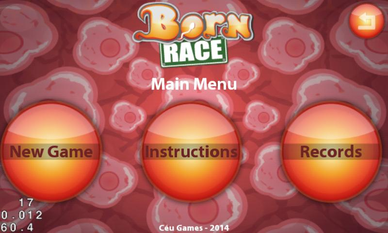
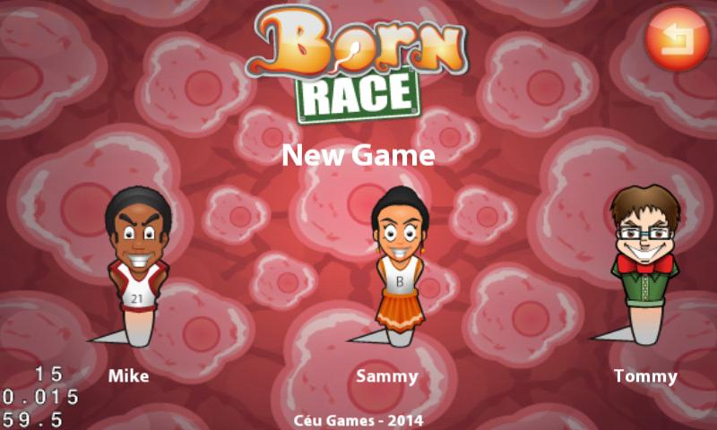
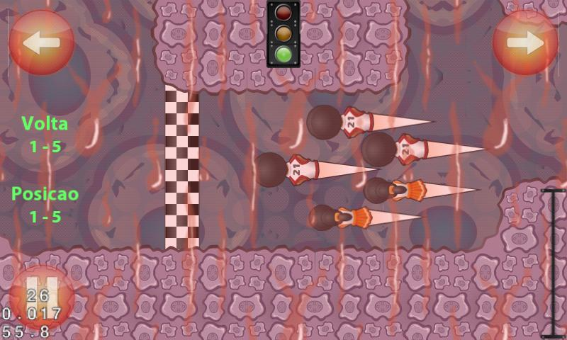

# Born Race

A sperm racing game programmed for mobile devices.
Game programmed with responsive design to four distinct screen sizes and with landscape orientation.
This project used the [cocos2d-x](http://www.cocos.com) graphic engine and the [Box2D](http://www.box2d.org) physics engine.

The user interaction occurs through the accelerometer or through some buttons in the corners of the touch screen.
This project was led in Céu Games company by one game designer ([Fabiano Naspolini de Oliveira](http://www.fabricadejogos.net)), two software engineers (Santiago Viertel and [Thalisson Christiano de Almeida](https://github.com/thalisson-ca)) and one graphic artist ([David Alves Fernandes Neto](https://www.deviantart.com/davidneto)).
The target platforms are iOS and Android.

## Sample images

__Main menu screen__

__Character selection screen__

__Gameplay screen__

## Technical information

- __Platforms__: iOS and Android
- __Used libraries__: cocos2d-x and Box2D
- __Programming language__: C/C++
- __Last code change__: 2015
